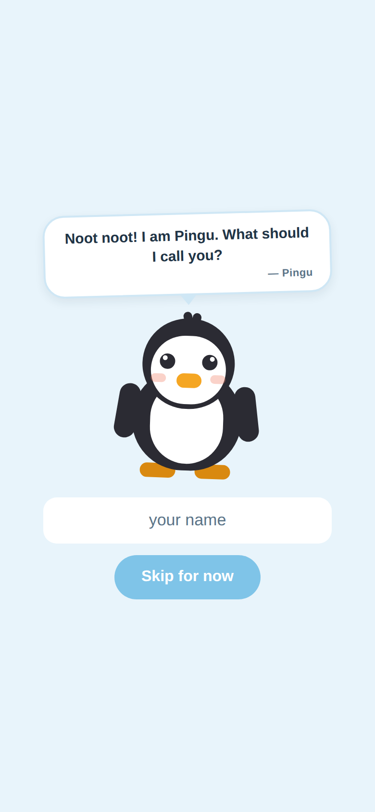
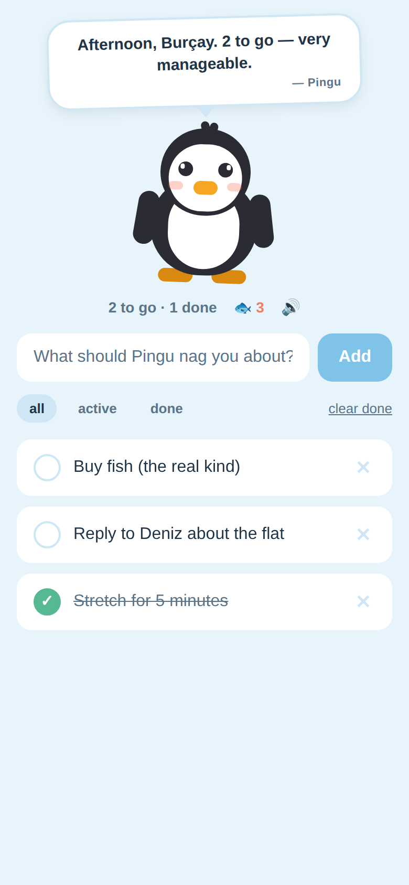
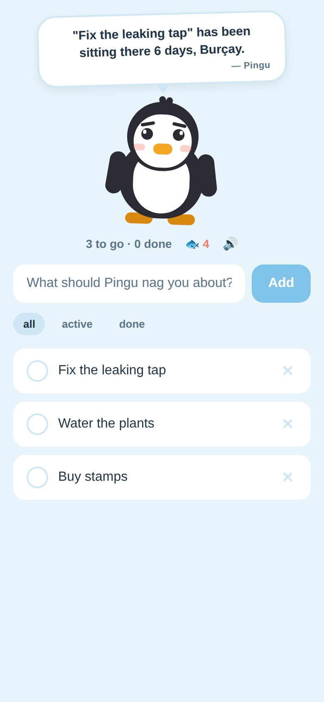
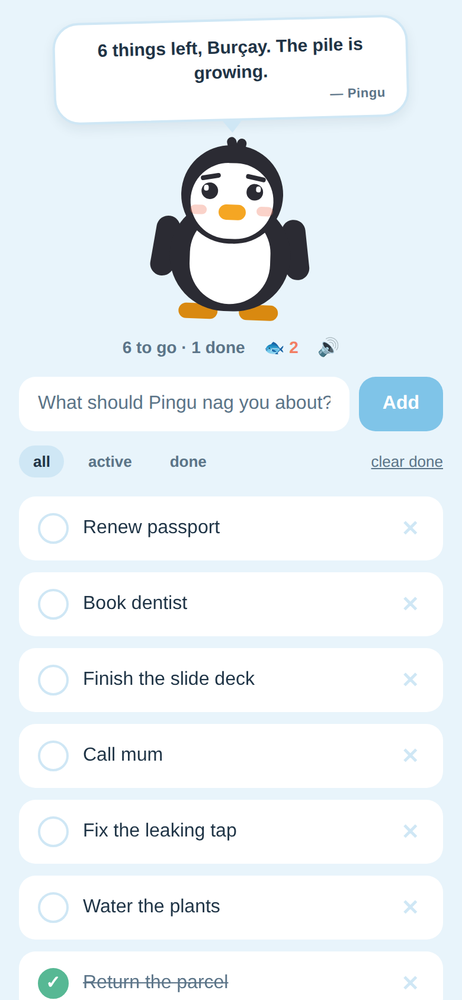
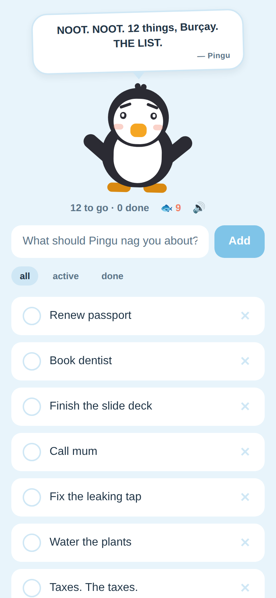
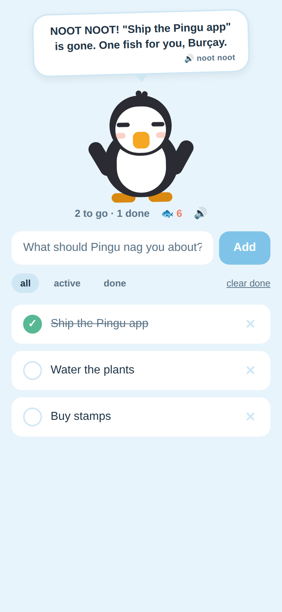

# pingutodoapp

A funny todo app represented by Pingu.

Cross-platform (iOS, Android, web) via Expo + React Native. Tasks live on the
device — no account, no backend, works offline.

Pingu is a mascot who leaves you personal notes. He knows your name, how long
you were away, which task you have been ignoring, and how many fish you have
earned — and he says the notes out loud.

## Screenshots

| Meeting Pingu | A note for you | Ignoring a task |
| --- | --- | --- |
|  |  |  |

| Pile growing | Full panic | You finished one |
| --- | --- | --- |
|  |  |  |

Regenerate them with `npm run shots` (needs `npx playwright install chromium`
once). The script serves the web build and seeds each scene through
localStorage, so no clicking is involved.

## Run it

```bash
npm install
npm start          # then press i / a, or scan the QR with Expo Go
npm run typecheck  # tsc --noEmit
npm run shots      # rebuild docs/screenshots
```

`npm run ios` needs macOS + Xcode; `npm run android` needs Android Studio.
Expo Go on a real phone needs neither.

## What's here

| Path | Purpose |
| --- | --- |
| `App.tsx` | Screen layout: Pingu's note, composer, filters, list |
| `src/notes.ts` | The note engine — which note Pingu leaves, and when |
| `src/mood.ts` | The baseline mood the list implies |
| `src/voice.ts` | Text-to-speech, wrapped so a device without it just stays quiet |
| `src/useTodos.ts` | All state — add / toggle / delete / filter, auto-persisted |
| `src/storage.ts` | `Store` interface + AsyncStorage implementation |
| `src/components/Pingu.tsx` | The mascot, drawn with plain Views and `Animated` |
| `src/components/NoteCard.tsx` | The paper note above his head |
| `src/components/Hello.tsx` | First launch — Pingu asks what to call you |
| `tools/screenshots.mjs` | Renders the screenshots above |

## How the notes work

`src/notes.ts` holds buckets of interchangeable lines in **priority order**, and
the first bucket that applies is the note Pingu leaves. Ordering is the whole
design — a task finished a second ago beats everything, a milestone beats a
generic greeting:

| Priority | Applies when | Pingu |
| --- | --- | --- |
| 1 | you just ticked something off | cheers, names the task, hands you a 🐟 |
| 2 | you were away a day or more | welcomes you back, counts the days |
| 3 | everything is done | has nothing to do with himself |
| 4 | a task is 3+ days old | points at it, by name, with the day count |
| 5 | fish hits a multiple of 10 | tells the other penguins about you |
| 6 | 10+ open tasks | panics |
| 7 | 5+ open tasks | worries |
| 8 | it's past 22:00 | tells you to go to bed |
| 9 | otherwise | greets you by time of day |

Tap Pingu for another line from the same bucket; he reads each one aloud
(`expo-speech`, high pitch, slightly slow) with his beak moving while he talks.
🔊 in the stats row mutes him. His face follows the note: half-lidded eyes and
angled brows when worried, pinprick pupils and raised flippers when panicking,
eyes squeezed shut mid-hop when cheering.

## Where this goes next

Deliberately left out so the first version stays small:

- **Due dates and reminders** — `expo-notifications`; Pingu's panic can key off
  what's overdue rather than raw count, and a note can arrive as a push.
- **Sync across devices** — write a second `Store` (Supabase is the low-effort
  option) and swap it in `App.tsx`. Nothing in the UI needs to change.
- **Store builds** — `eas build`. `app.json` is already the source of truth for
  icons and names.
- **Streaks** — the data is already there (`completedAt` on every task).
